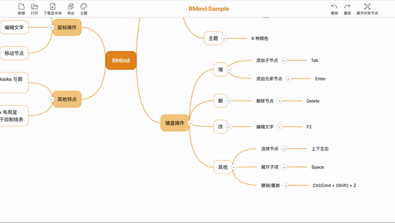
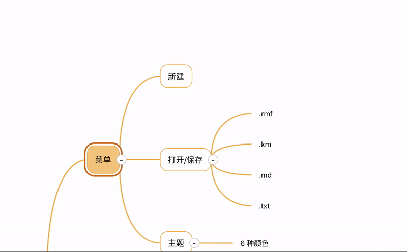
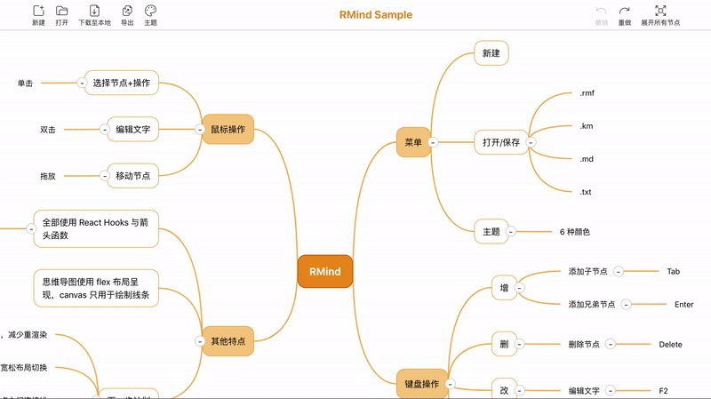

# RMind

基于 React Hooks 与 flex 布局，实现了大部分功能的思维导图。

An almost-full-function Mindmap web app developed with only React Hooks and flex layout.

Demo 地址：https://mongkii.github.io/RMind-Demo/

<a href="./docs/sample.rmf">示例用导图文件</a>

## 特点
- 完全使用 React Hooks 开发，所有功能均由箭头函数实现
- 用 flex 布局完成思维导图排版，唯一用到 canvas 的地方是绘制节点连接线

## 支持
- 节点的增删改等基本功能
- 拖拽操作
- 撤销/重做
- 导入及导出 .km（百度脑图） .md（Makrdown） .txt 格式的思维导图
- 将导图保存为图片
- 切换主题

## 演示

- 拖拽操作

- 键盘操作

- 切换主题

## 操作方式
### 鼠标操作
  - 单击选中节点
  - 双击编辑节点文字
  - 拖拽移动节点

### 键盘操作

|功能|按键|
|----|----|
|切换所选节点|`↑`/`↓`/`←`/`→`|
|添加子节点|`Tab`|
|添加兄弟节点|`Enter`|
|删除节点|`Backspace`/`Delete`|
|修改节点文字|`F2`|
|切换显示子节点|`Space`|
|撤销|`Cmd/Ctrl`+`Z`|
|重做|`Cmd/Ctrl`+`Shift`+`Z`|

编辑文字状态下：

|功能|按键|
|----|----|
|取消|`Esc`|
|确认|`Enter`|

## 下一步计划

- 自定义主题
- 布局在紧凑/宽松间切换
- 大纲等其他导图样式
- Minimap + 导图缩放
- 优化 Hooks 使用，避免不必要的渲染
